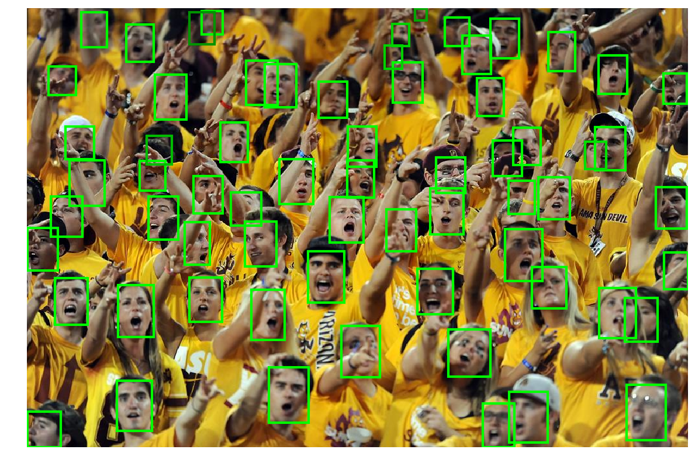

### SSH: Single Stage Headless Face Detector
Jupyter Notebook for https://github.com/mahyarnajibi/SSH

### Simple guide to run demo.py

Update July 2020 

  1. Python 2.7 is deprecated in Google Colab, and we should use this link to open Colab based on  Python 2.7 
  https://colab.research.google.com/notebook#create=true&language=python2
  </br>(source of that url: https://stackoverflow.com/a/61479823/6355116)
  2. Open my jupyter notebook [caffe_ssh.ipynb](caffe_ssh.ipynb)
  3. Then open "Runtime"/ "Change runtime type" and select Python 2 and GPU 
  4. Run jupyter notebook cells one by one
  5. Finally you will able to run demo.py
  
    >> rezult will save in /content/SSH/data/demo/demo_detections_SSH.png
  
  
 
This repository includes the code for training and evaluating the *SSH* face detector introduced in our [**ICCV 2017 paper**](https://arxiv.org/abs/1708.03979).

### Citing
If you find *SSH* useful in your research please consider citing:
```
@inproceedings{najibi2017ssh,
title={{SSH}: Single Stage Headless Face Detector},
author={Najibi, Mahyar and Samangouei, Pouya and Chellappa, Rama and Davis, Larry},
booktitle={The IEEE International Conference on Computer Vision (ICCV)},
year={2017}
}
```
